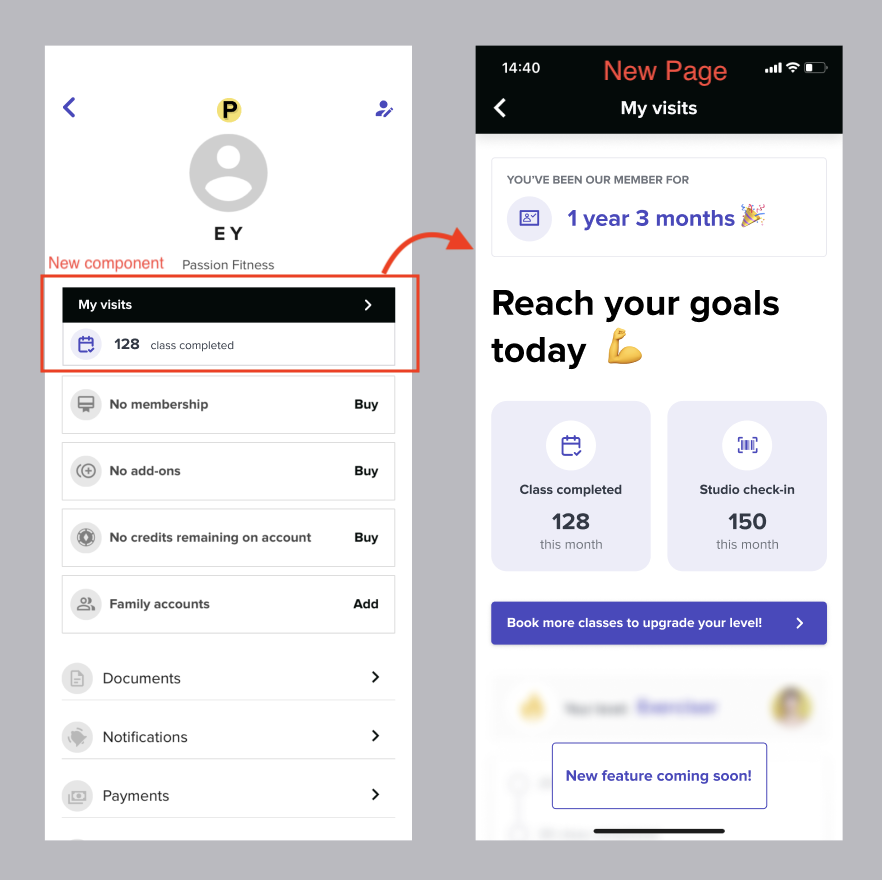

# Instructions

# Task 1 - Design decomposition - 10min
Adding a new feature always bring new challenges, one of the most common challenges we face as a team is how to slice something to deliver the biggest value for customers with the smallest amount of work.

This exercise asks the candidate to explore the different ways this piece of work could be approached.

Problem statement:

```
Members want to be able to see Visits and attendance inside the profile screen
```



# Task 2 - Complete the form! - 35min (pair programming)

## Goal
Implement an appointment form that:
1. Fetches staff from `STAFF_ENDPOINT` when the app loads.
2. Filters by `type === 'trainer'`.
3. Renders a normal `<select>` with only trainers.
4. Controls inputs: name, email, date/time, trainer.
5. Validates using/adapting the `config` object (fix obvious mistakes).
6. Submits to `APPOINTMENT_ENDPOINT` with correct body.
7. Shows states: loading (fetch), empty (no trainers), error (fetch/submit), success (after submit).

Adding basic unit tests are more than appreciated.

## Suggested Flow
1. Say plan aloud.
2. Fetch staff → filter trainers → populate select.
3. Make form inputs controlled + validation.
4. Implement submit (disable during request; show success/error).
5. If time: improvements.

## Using Internet / AI
Allowed. State intent first. Review output critically.

## Endpoints
Defined in `src/App.tsx`:
- `STAFF_ENDPOINT`
- `APPOINTMENT_ENDPOINT`

## Scripts
```
npm install
npm start
npm test
```

Deliver core first; enhance only if time.
